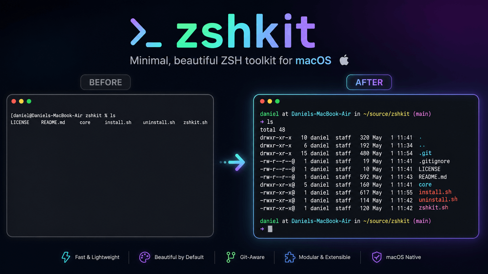

# zshkit ⚡

A minimal, fast and beautiful ZSH toolkit for macOS developers.



## ✨ Features

* 🎨 Clean and colorful terminal
* 📂 Enhanced `ls` output
* 🌿 Git branch in prompt
* ⚡ Lightweight & fast
* 🧩 Modular architecture

## 🚀 Install

```bash
git clone https://github.com/danielbadry/zshkit.git
cd zshkit
chmod +x install.sh
./install.sh
source ~/.zshrc
```

## 🔥 Preview

```
danial at MacBook in ~/project (main)
➜
```

## 📁 Structure

```
core/
  ├── colors
  ├── aliases
  └── prompt
```

## 🧹 Uninstall

```bash
./uninstall.sh
```

## 🤝 Contributing

PRs are welcome!
